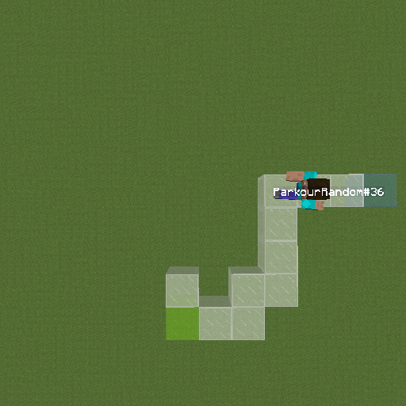
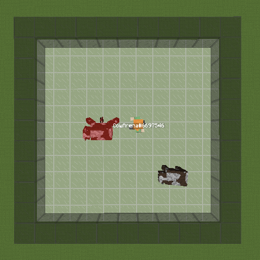
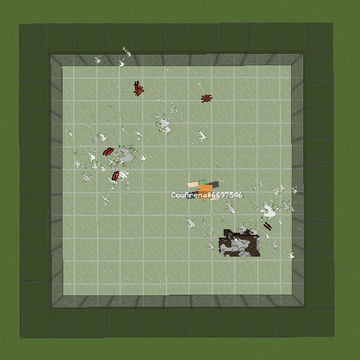
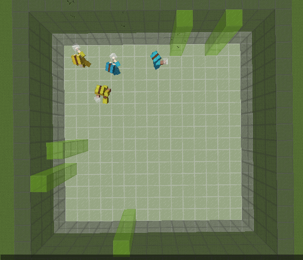
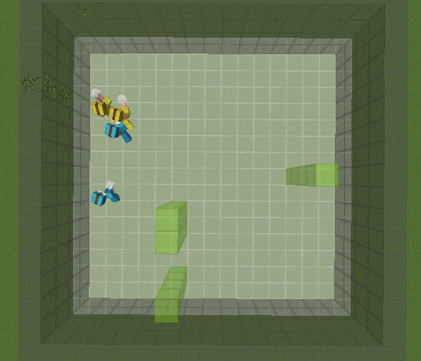

## Animated Figures

**Animated Figure 1:** *Comparison between direct screen recording and screen recording after reconstruction according to our recording format. This gif is 300 MB while the world recording is only 1.5 MB and could be used to render from any position.*

**Animated Figure 2:** *Parkour environment after 9 million time steps of A2C. The agent succeeds most of the time.*

**Animated Figure 3:** *CowArena environment with attention layer in the training setting (1-2 cows).*

**Animated Figure 4:** *CowArena environment with attention layer transfer to another setting (trained with 1-2 cows, tested with 1-20 cows).*

**Animated Figure 5:** *Simple policy: data*

**Animated Figure 6:** *Simple policy: imitation*
